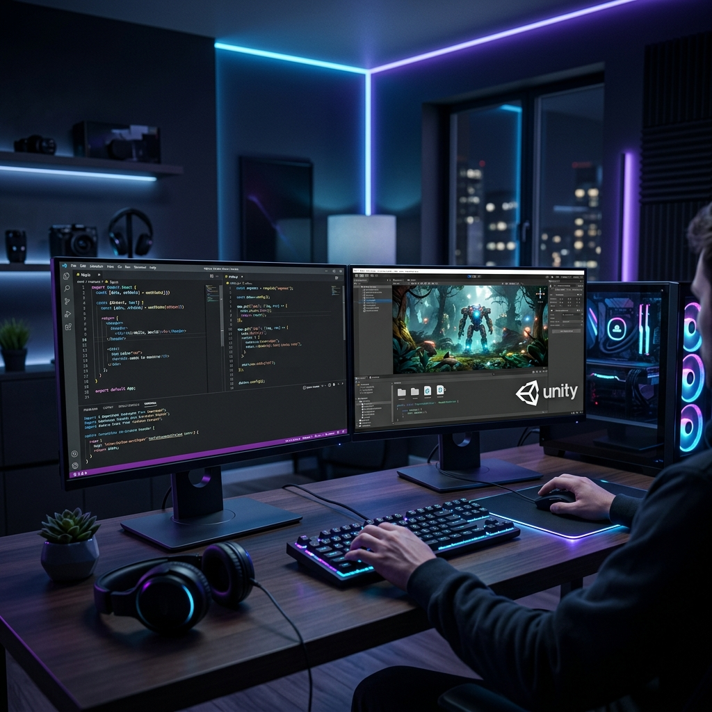

# 🚀 Salman Sadiq - Full Stack & Game Development Portfolio



A high-performance, immersive, and fully responsive personal portfolio designed to showcase a diverse range of projects—from **Unity Game Development (PC, Android, XR)** to **Modern Full-Stack Web Applications**.

---

## 🌟 Key Features

- **🎮 Comprehensive Project Gallery**: Filterable showcase of WebGL, Android, PC, AR, VR, and AI/ML projects.
- **🎨 Modern Professional UI**:
    - Built with **React 19** and **Vite** for lightning-fast performance.
    - **ScrollReveal** for smooth, interactive entry animations.
    - **Swiper.js** for touch-responsive project sliders and testimonials.
    - **Dark/Light Mode** support with dynamic theme switching.
- **📧 Integrated Contact System**:
    - Custom **Node.js/Express** backend.
    - **MySQL** database for permanent message storage.
    - **Nodemailer** for instant email notifications on form submissions.
- **📱 Fully Responsive**: Optimized for everything from ultra-wide monitors to mobile devices.
- **🛠️ Service Showcases**: Dedicated pages for Game Development, Web Development, and Graphic Design.

---

## 🛠️ Technical Stack

### Frontend (Client)
| Technology | Description |
| :--- | :--- |
| **React 19** | Modern UI library for high-performance components. |
| **Vite** | Next-generation frontend tooling for rapid development. |
| **React Router 7** | Seamless client-side navigation. |
| **Vanilla CSS** | Custom styling with modern techniques (CSS Variables, Flexbox, Grid). |
| **ScrollReveal** | Smooth scroll animations for a premium feel. |
| **Swiper.js** | Advanced touch sliders and carousels. |

### Backend (Server)
| Technology | Description |
| :--- | :--- |
| **Node.js** | JavaScript runtime for scalable server-side applications. |
| **Express 5** | Minimalist web framework for building robust APIs. |
| **MySQL2** | Fast MySQL driver with Promise support. |
| **Nodemailer** | Secure and reliable email handling. |
| **CORS / Dotenv** | Security and environment management. |

### Database
| Technology | Description |
| :--- | :--- |
| **MySQL 8.0** | Industry-standard relational database for inquiry storage. |
| **Aiven DB Integration** | Production-ready cloud database support. |

---

## 📂 Project Structure

```text
salman-portfolio/
├── 📁 api/             # Node.js/Express Backend
│   ├── index.js        # Main API entry & Database init
│   └── .env            # Environment variables (DB, Email)
├── 📁 public/          # Static Assets
│   ├── 📁 images/      # Project screenshots & Banners
│   └── 📁 Files/       # Resume & downloadable documents
├── 📁 src/             # React Frontend
│   ├── 📁 components/  # Reusable UI (Header, Footer, Theme)
│   ├── 📁 pages/       # Page components (Home, Experience)
│   ├── 📁 css/         # Global & component-specific styles
│   ├── App.jsx         # Main Routing logic
│   └── main.jsx        # App entry point
├── vercel.json         # Vercel Deployment configuration
└── package.json        # Unified scripts and dependencies
```

---

## 🚀 Local Development

### 1. Prerequisites
- **Node.js** (v18+)
- **MySQL Server** (Running locally or in the cloud)

### 2. Installation
Clone the repository and install dependencies:
```bash
npm install
```

### 3. Environment Setup
Create a `.env` file in the `api/` directory (referencing `api/.env.example` if available):
```env
DB_HOST=localhost
DB_PORT=3306
DB_USER=your_user
DB_PASSWORD=your_password
DB_NAME=portfolio
EMAIL_USER=your_gmail@gmail.com
EMAIL_PASS=your_app_password
RECEIVER_EMAIL=your_email@gmail.com
```

### 4. Running the Project
The project uses `concurrently` to run both the Vite frontend and Express backend with a single command:
```bash
npm run dev:all
```
- **Frontend**: [http://localhost:5173](http://localhost:5173)
- **Backend API**: [http://localhost:5000/api](http://localhost:5000/api)

---

## 🔗 Live API Endpoints

| Method | Endpoint | Description |
| :--- | :--- | :--- |
| `POST` | `/api/contact` | Submit a contact form inquiry. |
| `GET` | `/api/messages` | (Admin) View all stored messages. |

---

## 🛡️ License
This project is for personal use and portfolio representation.

## 👨‍💻 Developed By
**Salman Sadiq**
*Associate Software Engineer at Ilmversity by Da1Ilmverse*

[](https://linkedin.com/in/salman-sadiq-ab58a4248)
[](https://www.youtube.com/@ss.entertainment1717)
[](https://wa.me/923034736071)

